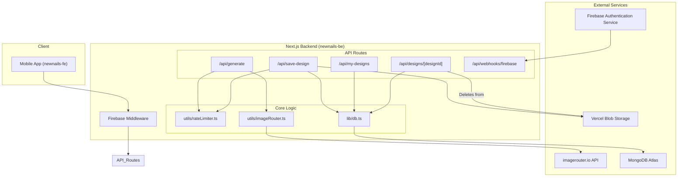
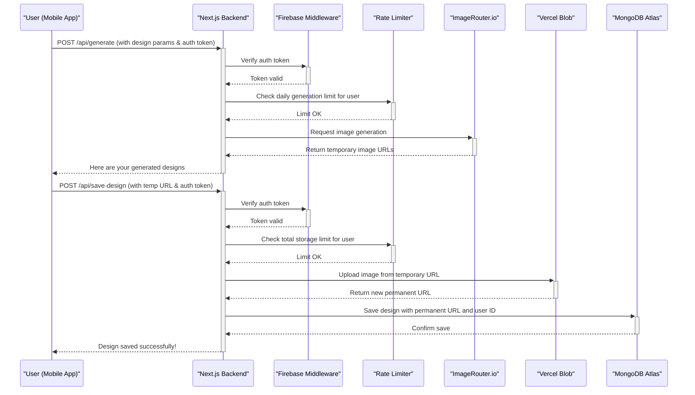

# Backend Architecture Diagrams (Mermaid Syntax)

This file contains Mermaid.js diagrams for the `newnails-be` backend architecture.

## 1. High-Level Component Diagram

This diagram shows the overall architecture, including the client, the Next.js application, external services, and the database.

## 2. Sequence Diagram: Generate & Save Design Flow

This diagram details the step-by-step process from a user requesting a design to it being saved in their collection.

