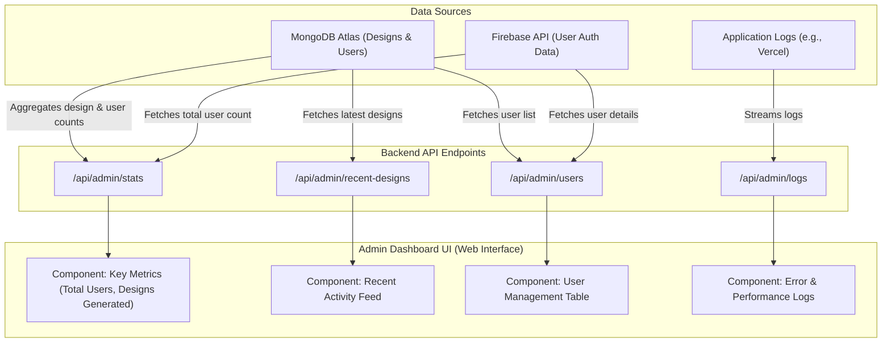

# Admin Dashboard Architecture (Mermaid Syntax)

This file contains Mermaid.js syntax for visualizing the architecture of a potential admin dashboard for the `newnails-be` service.

## Admin Dashboard Data Flow

This diagram shows how data from different sources flows through the backend API to populate the components of a web-based admin dashboard.



### How to Use This

1.  Go to [Mermaidchart.com](https://www.mermaidchart.com/).
2.  Create a new diagram.
3.  Copy the code block above (the part inside the ```mermaid ... ```).
4.  Paste it into the code editor on Mermaidchart.
5.  The site will automatically generate the visual flowchart diagram for you.
